# Simulador DFSA

## Integrantes
- Vitor Maia
- Daniel

---

## Detalhes de implementação
- Foi escolhido a linguagem C++ para escrever o simulador
- Os gráficos foram gerados em python
- O código está disponível em <https://github.com/vitorcodesalittle/simulador-dfsa>

---

## Comparando o *número total de slots*
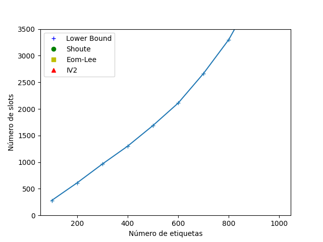 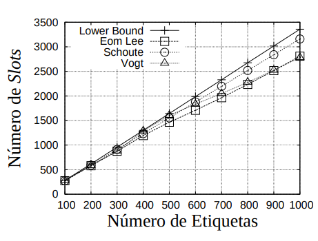

---

## Comparando o *número total de slots vazios*

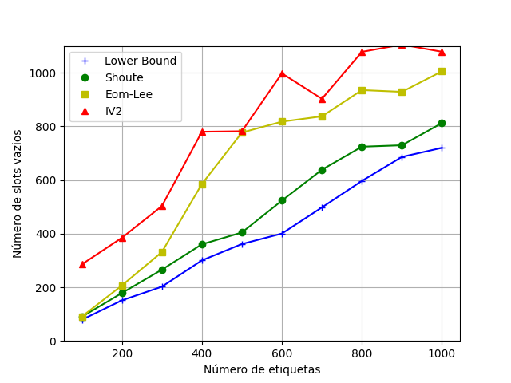 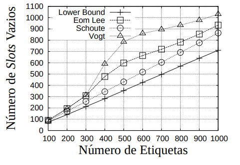

---

## Comparando o *número total de slots em colisão*

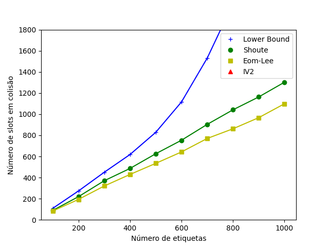 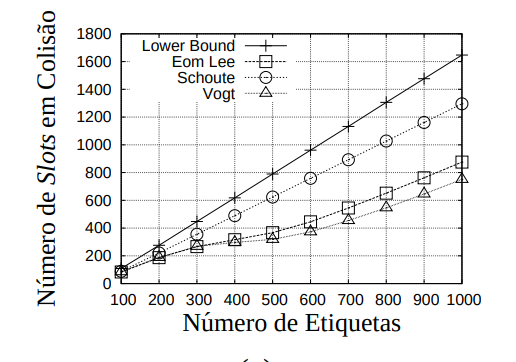

---

## Comparando o *tempo médio de execução*

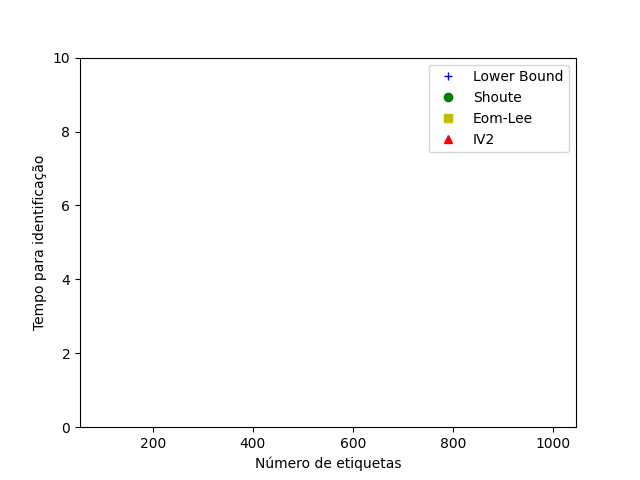

---

## Comparando o *número total de slots* com frames limitados a $2^Q$

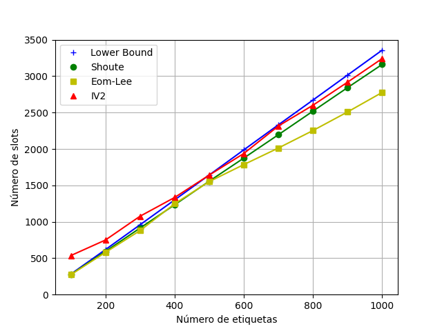 

---

## Comparando o *número total de slots vazios*  com frames limitados a $2^Q$

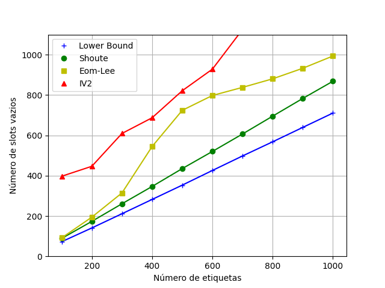 

---

## Comparando o *número total de slots em colisão* com frames limitados a $2^Q$

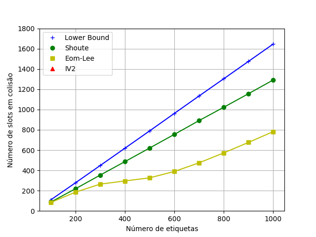 

---

## Comparando o *tempo médio de execução* com frames limitados a $2^Q$

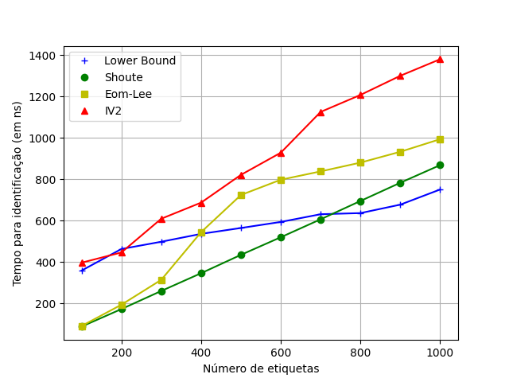

---

## Fim

#### Obrigado pela atenção

---
