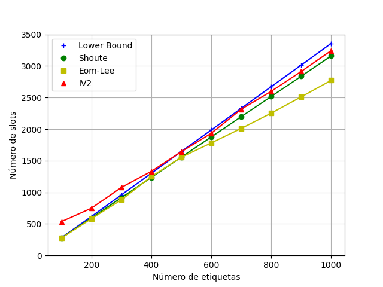
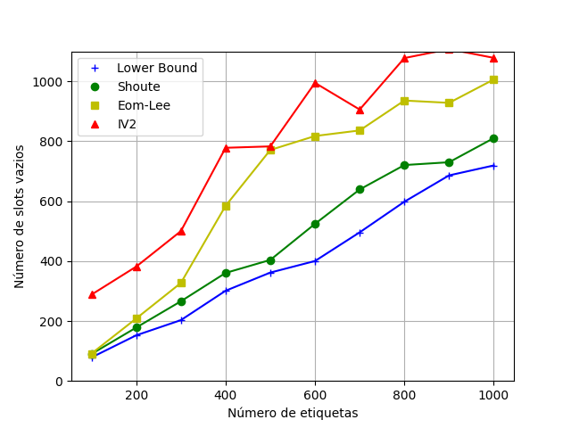

# Simulador DFSA

## Integrantes
- Daniel Henrique
- Vitor Maia

---

## Detalhes de implementação
- Foi escolhido a linguagem C++ para escrever o simulador
- Os gráficos foram gerados com [pyplot](https://matplotlib.org/)
- O código está disponível em <https://github.com/vitorcodesalittle/simulador-dfsa>

---

**Código do simulador (1/2)**

```cpp
 Result Simulator::run(ull ntags) {
    ull nSuccess = 0;
    Result result{};
    while (true) {
        std::unordered_map<ull, ull> slots_counter;
        for (int i = 0; i < ntags - nSuccess; i++) {
            int f = random_slot(current_frame_size);
            if (!slots_counter.count(f)) {
                slots_counter[f] = 1;
            } else {
                slots_counter[f]++;
            }
        }
```
---
**Código do simulador (2/2)**
```cpp
        ull success = 0, colisoes = 0;
        for (auto p : slots_counter) {
            ull count = p.second;
            success += count == 1;
            colisoes += count > 1;
        }
        ull vazios = (current_frame_size - success - colisoes);
        auto info = SlottedAlohaInfo(success, colisoes, vazios, current_frame_size);
        auto t0 = std::chrono::high_resolution_clock::now();
        ull next_frames = estimator.next_frames(info);
        long long ns = std::chrono::duration_cast<std::chrono::nanoseconds>(std::chrono::high_resolution_clock::now() - t0).count();
        result.total_collision_slots += colisoes;
        result.total_empty_slots += vazios;
        result.total_slots += current_frame_size;
        result.time += ns;
        if (info.colisoes == 0) {
            break;
        }
        nSuccess += success;
        if (use_power_of_2) {
            current_frame_size = get_closest_po2(next_frames);
        } else {
            current_frame_size = next_frames;
        }
        slots_counter.clear();
    }
     return result;
}
```
---
## Estimadores

- Lower-Bound:

$$
\hat{f} = 2 * n
$$

```cpp
ull LowerBoundEstimator::next_frames(SlottedAlohaInfo &info) {
    return info.colisoes * 2;
}
```

---

- Shoute:

$$
\hat{f} = 2.39 * n
$$

```cpp
ull ShoutEstimator::next_frames(SlottedAlohaInfo &info) {
    return static_cast<ull>(ceil(2.39 * info.colisoes));
}
```
---

- Eom-Lee:
$$
\beta_k = \frac{L}{\gamma_{k-1}s_c + s_s}
$$
  
$$
\gamma_k =  \frac{1 - \exp(-\frac{1}{\beta_k})}{\beta_k (1 - (1 + \frac{1}{\beta_k)})  \exp(-\frac{1}{\beta_k}))}
$$

enquanto $|\gamma_k - \gamma_{k-1}| < \epsilon$ e usamos $\epsilon =10^{-3}$. $\hat{f} = \gamma* . s_c$


```cpp
ull EomLeeEstimator::next_frames(SlottedAlohaInfo &info) {
    double threshold = 1e-3;
    double L = static_cast<double>(info.used_frame);
    double gamma_k, gamma = 2, beta = std::numeric_limits<double>::max();
    do {
        gamma_k = gamma;
        beta = L / ((gamma_k * info.colisoes) + info.sucessos);
        gamma = (1 - exp(-1.0/beta)) / (beta * (1 - (1 + 1.0/beta) * exp(-1.0/beta)));
    } while (abs(gamma - gamma_k) > threshold);
    return static_cast<ull>(ceil(gamma * info.colisoes));
}
```

---

- IV2

```c++
ull IV2Estimator::next_frames(SlottedAlohaInfo &info) {
    if (info.used_frame != info.colisoes) {
        return next_frames_vogt(info);
    }
    double s;
    if (initial_frame_size <= 64) s = 100;
    else s = 10000;
    double n;
    if (s == 100) n = 6.851851850 * (info.used_frame - 1) +  2;
    else if (s == 1000) n = 9.497497500 * (info.used_frame-1) + 2;
    else if (s == 10000) n = 12.047047047 * (info.used_frame-1) + 2;
    return static_cast<ull>(ceil(n));
}

```
Onde `L` é o tamanho de quadros, `s` é o fator multiplicativo $\delta$

---

- IV2 (continuação)
Caso o número de colisões seja menor que o tamanho do frame,
usa-se o estimador vogt
 
```c++
ull IV2Estimator::estimate(ull L, ull r, ull n) {
    return L * combinations(n, r) * pow(1.0/L, r) * pow(1 - 1.0/L, n-r);
}
double IV2Estimator::calc_epsilon(SlottedAlohaInfo &info, ull n) {
    ull a0 = estimate(info.used_frame, 0, n); // estimativa vazios
    ull a1 = estimate(info.used_frame, 1, n); // estimativa sucessos
    ull arest = 0; // estimativas colisões acumulada
    for (int r = 2; r <= n; r++) {
        arest += estimate(info.used_frame, r, n);
    }
    return (Vec3{a0, a1, arest} - Vec3{info.vazios, info.sucessos, info.colisoes}).len();
}
ull IV2Estimator::next_frames_vogt(SlottedAlohaInfo &info) {
    double high = 3e3, low = 2;
    while (high - low > 1) {
        double nhigh = calc_epsilon(info , high);
        double nlow = calc_epsilon(info, low);
        double m = (high - low) / 2;
        if (nhigh < nlow) low = low + m;
        else high = high - m;
    }
    return static_cast<ull>(ceil(low));
}
```

---

- O fato de fazermos uma busca pelo $n$ que minimiza $\epsilon$ torna essa
implementação muito lenta

---
#### Configurações de experimentos:
- Quadros limitados a potência de 2
- Quadros sem limites de tamanho
#### Para todos os experimentos:
- Tamanho do quadro inicial: 64
- Número de repetições 2000
- Número de tags = 100, 200, ..., 1000
#### Comparativos
- Frames limitados a $2^Q$ com resultados do [artigo](https://www.cin.ufpe.br/~pasg/gpublications/AnGo11.pdf) (Seção 3)
  - Total de slots, slots com colisão, slots vazios
- Frames limitados a $2^Q$ x Frames sem limites
  - Total de slots, slots com colisão, slots vazios, tempo de execução

---

#### Comparando o *número total de slots* com frames limitados a $2^Q$

 

---

#### Comparando o *número total de slots vazios*  com frames limitados a $2^Q$

 

---

#### Comparando o *número total de slots em colisão* com frames limitados a $2^Q$

 

---

### Comparando o efeito de limitar o tamanho do quadro a potências de 2

À esquerda temos sem o limite, e a direita com o limite

---

#### Comparando o *número total de slots*
 

---

#### Comparando o *número total de slots vazios*

 

---

#### Comparando o *número total de slots em colisão*

 

---

#### Comparando o *tempo médio de execução*

 

---

## Fim

#### Obrigado pela atenção


---

