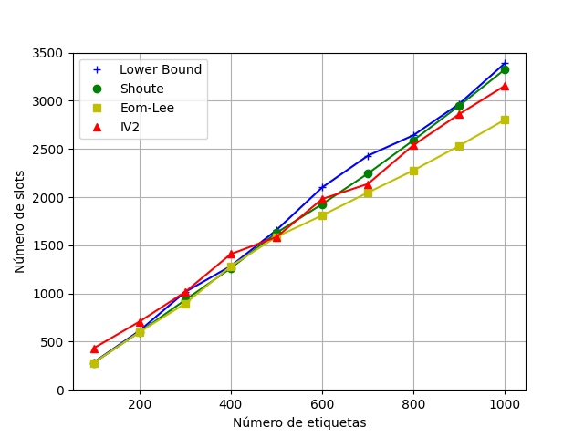

# Simulador DFSA

## Integrantes
- Daniel Henrique
- Vitor Maia

---

## Detalhes de implementação
- Foi escolhido a linguagem C++ para escrever o simulador
- Os gráficos foram gerados com [pyplot](https://matplotlib.org/)
- O código está disponível em <https://github.com/vitorcodesalittle/simulador-dfsa>

---

## Estimadores

- Lower-Bound:

$$
\hat{f} = 2 * n
$$

```cpp
ull LowerBoundEstimator::next_frames(SlottedAlohaInfo &info) {
    return info.colisoes * 2;
}
```

---

- Shoute:

$$
\hat{f} = 2.39 * n
$$

```cpp
ull ShoutEstimator::next_frames(SlottedAlohaInfo &info) {
    return static_cast<ull>(ceil(2.39 * info.colisoes));
}
```

- Eom-Lee:
$$
\beta_k = \frac{L}{\gamma_{k-1}s_c + s_s}
$$
  
$$
\gamma_k =  \frac{1 - \exp(-\frac{1}{\beta_k})}{\beta_k (1 - (1 + \frac{1}{\beta_k)})  \exp(-\frac{1}{\beta_k}))}
$$

enquanto $|\gamma_k - \gamma_{k-1}| < \epsilon$ e usamos $\epsilon = 5$. $\hat{f} = \gamma* . s_c$


```cpp
ull EomLeeEstimator::next_frames(SlottedAlohaInfo &info) {
    double threshold = 5e-5;
    double L = static_cast<double>(info.used_frame);
    double gamma_k, gamma = 2, beta = std::numeric_limits<double>::max();
    do {
        gamma_k = gamma;
        beta = L / ((gamma_k * info.colisoes) + info.sucessos);
        gamma = (1 - exp(-1.0/beta)) / (beta * (1 - (1 + 1.0/beta) * exp(-1.0/beta)));
    } while (abs(gamma - gamma_k) > threshold);
    return static_cast<ull>(ceil(gamma * info.colisoes));
}
```

---

- IV2
Se o número de colisões for diferente do tamanho do quadro ($s_c \ne L$), usamos o vogt, isto é, buscamos um $n$ que minimize:
$$
\epsilon = ||(a^L_{0, n}, a^L_{1, n}, a^L_{r_{i>=2}, n}) - (s_v, s_s, s_c)||
$$
Caso contrário, usamos as seguintes aproximações:
 
```c++
    if (L <= 64) s = 100;
    else if (L > 64 && L < 128) s = 1000;
    else s = 10000;
    if (s == 100) n = 6.851851850 * (L - 1) +  2;
    else if (s == 1000) n = 9.497497500 * (L-1) + 2;
    else if (s == 10000) n = 12.047047047 * (L-1) + 2;
    return static_cast<ull>(ceil(n));
```
Onde `L` é o tamanho de quadros, `s` é o fator multiplicativo $\delta$

---

- IV2 (continuação)
 
```c++
    if (L <= 64) s = 100;
    else if (L > 64 && L < 128) s = 1000;
    else s = 10000;
    if (s == 100) n = 6.851851850 * (L - 1) +  2;
    else if (s == 1000) n = 9.497497500 * (L-1) + 2;
    else if (s == 10000) n = 12.047047047 * (L-1) + 2;
    return static_cast<ull>(ceil(n));
```


Como entendemos que $\delta$ é uma constante ajustável que melhora dependendo da quantidade média de tags em várias leituras, usamos um $\delta$ que varia de acordo com $L$

Calculamos a estimatima de tags $\hat{n}$ apenas para os valores possívels de $\delta$ em nossa implementação($10²$, $10³$ e $10⁴$)

Quando caímos no caso $L \ne s_c$ e calculamos a estimativa do vogt, usamos uma busca binária para o valor de $\hat{n}$, o que pareceu tornar o algoritmo como um todo mais lento (pode ser encontrada ao fim do slide).

---

### Configurações de experimentos:
- Quadros limitados a potência de 2
- Quadros sem limites de tamanho

### Para todos os experimentos:
- Tamanho do quadro inicial: 64
- Número de repetições 1000
- Número de tags = 100, 200, ..., 1000
---

## Comparando o *número total de slots*
 

---

## Comparando o *número total de slots vazios*

 

---

## Comparando o *número total de slots em colisão*

 

---

## Comparando o *tempo médio de execução*


---

## Comparando o *número total de slots* com frames limitados a $2^Q$

 

---

## Comparando o *número total de slots vazios*  com frames limitados a $2^Q$

 

---

## Comparando o *número total de slots em colisão* com frames limitados a $2^Q$

 

---

## Comparando o *tempo médio de execução* com frames limitados a $2^Q$


---

## Busca binária no vogt

<!-- para essa busca funcionar, a função para cálculo de epsilon em função de n
deve ser monotônica. -->

```c++

ull next_frames_vogt(SlottedAlohaInfo &info) {
    double high = 3e3, low = 2;
    double threshold = 1;
    while (high - low > threshold) {
        double nhigh = calc_epsilon(info , high);
        double nlow = calc_epsilon(info, low);
        double m = (high - low) / 2;
        if (nhigh < nlow) low = low + m;
        else high = high - m;
    }
    return static_cast<ull>(ceil(high));
}
```

---

## Fim

#### Obrigado pela atenção


---

