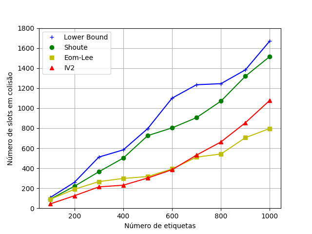
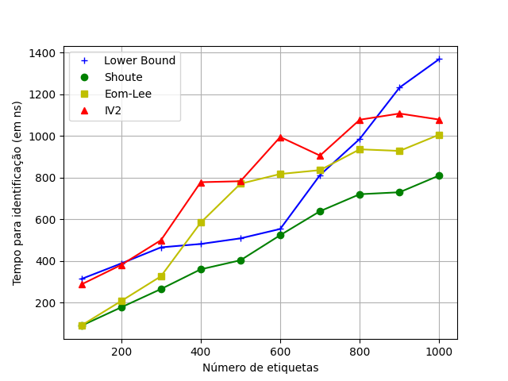
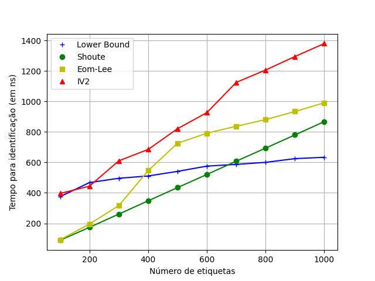

# Simulador DFSA

## Integrantes
- Vitor Maia
- Daniel

---

## Detalhes de implementação
- Foi escolhido a linguagem C++ para escrever o simulador
- Os gráficos foram gerados em python
- O código está disponível em <https://github.com/vitorcodesalittle/simulador-dfsa>

---

## Estimadores

- Lower-Bound:

$$
\hat{f} = 2 * n
$$

- Shoute:

$$
\hat{f} = 2.39 * n
$$

- Eom-Lee:
$$
\beta_k = \frac{L}{\gamma{k-1}s_c + s_s}
$$

$$
\gamma_k =  \frac{1 - \exp(-\frac{1}{\beta_k})}{\beta_k (1 - (1 + \frac{1}{\beta_k)})  \exp(-\frac{1}{\beta_k}))}
$$

enquanto $|\gamma_k - \gamma_{k-1}| < \epsilon$ e usamos $\epsilon = 5$

---

- IV2
Se o número de colisões for diferente do tamanho do quadro ($s_c < L$), usamos o vogt, isto é, buscamos um $n$ que minimize:
$$
\epsilon = ||(a^L_{0, n}, a^L_{1, n}, a^L_{r_{i>=2}, n}) - (s_v, s_s, s_c)||
$$
Caso contrário, segue o código:
 
```c++
    if (L <= 64) s = 100;
    else if (L > 64 && L < 128) s = 1000;
    else s = 10000;
    if (s == 100) n = 6.851851850 * (L - 1) +  2;
    else if (s == 1000) n = 9.497497500 * (L-1) + 2;
    else if (s == 10000) n = 12.047047047 * (L-1) + 2;
    return static_cast<ull>(ceil(n));
```
Onde `L` é o tamanho de quadros, `s` é o fator multiplicativo $\delta$

---

- IV2 (continuação)
 
```c++
    if (L <= 64) s = 100;
    else if (L > 64 && L < 128) s = 1000;
    else s = 10000;
    if (s == 100) n = 6.851851850 * (L - 1) +  2;
    else if (s == 1000) n = 9.497497500 * (L-1) + 2;
    else if (s == 10000) n = 12.047047047 * (L-1) + 2;
    return static_cast<ull>(ceil(n));
```


Como ententendemos que $\delta$ é uma constante ajustável que melhora dependendo da quantidade média de tags em várias leituras, usamos um \delta que varia de acordo com $L$.

Implementamos a estimatima de tags $\hat{n}$, apenas para os valores possívels de $\delta$ ($10²$, $10³$ e $10⁴$)

---

## Comparando o *número total de slots*
 

---

## Comparando o *número total de slots vazios*

 

---

## Comparando o *número total de slots em colisão*

 

---

## Comparando o *tempo médio de execução*



---

## Comparando o *número total de slots* com frames limitados a $2^Q$

 

---

## Comparando o *número total de slots vazios*  com frames limitados a $2^Q$

 

---

## Comparando o *número total de slots em colisão* com frames limitados a $2^Q$

 

---

## Comparando o *tempo médio de execução* com frames limitados a $2^Q$



---

## Fim

#### Obrigado pela atenção


---
